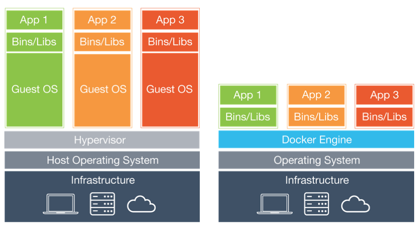
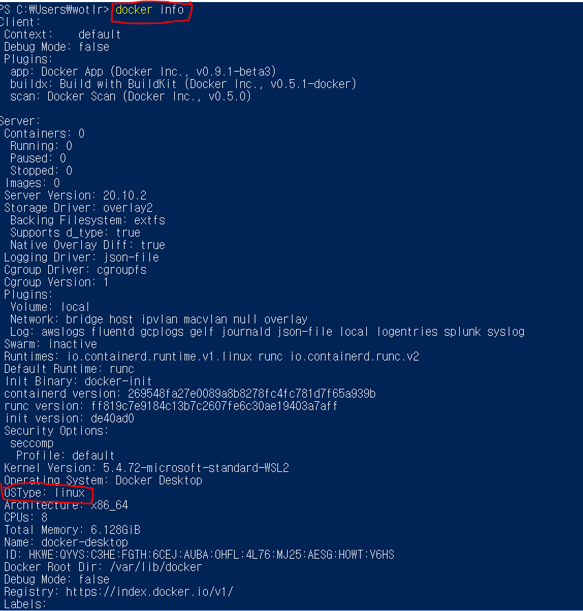
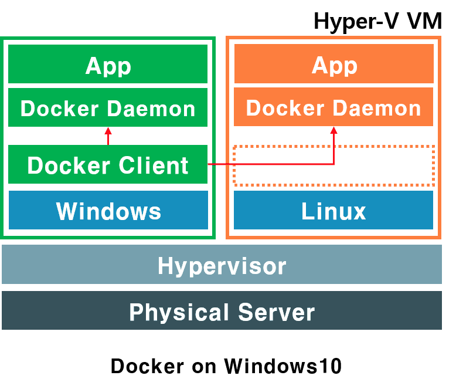

### 서버를 관리하자
일반적으로 서버를 관리한다는 건 복잡하고 어려우며 섬세한 작업이 필요한 영역이다.
하나의 서버에 여러개의 프로그램을 설치하는 것도 문제지만 사용하는 라이브러리의 버전이 다르거나
동일한 포트를 사용하는 경우 설치가 굉장히 까다롭다. 이럴 경우 차라리 각기 다른 서버에 설치하는 것이
나을 것이다. 하지만 그렇게 되면 PC가 늘어나고 자원의 낭비가 심해집니다. 
 
또한 DepOps의 등장으로 개발주기가 짧아지면서 배포는 더 자주 이루어지고 마이크로서비스 아키텍처가 유행하면서
프로그램은 더 잘개 쪼개져 관리는 더 복잡해지는 경우도 있다. 새로운 툴은 계속해서 나오고
클라우드의 발전으로 설치해야할 서버가 수백, 수천대에 이르는 상황에서 도커가 등장했다.

### Docker?
* 컨테이너 기반의 오픈소스 가상화 플랫폼  

일반적으로 컨테이너를 생각하면 배에 싣는 네모낳고 커다란 수송용 박스를 생각한다. 그 컨테이너 안에는
다양한 옷, 전자제품등 다양한 화물을 넣고 규격화되어 컨테이너선이나 트레일러등 다양한 운송수단으로 옮기게 된다. 
 
서버에서 이야기하는 것도 비슷한 맥락이다. 다양한 옷과 전자제품등이 다양한 프로그램, 실행환경을
컨테이너로 추상화하고 동일한 인터페이스의 제공으로 프로그램의 배포 및 관리를 단순하게 해준다.
백엔드 어플리케이션, 데이터베이스 서버, 메시지 큐등 컨테이너로 추상화 하여 어디에서든 실행할 수 있다. 
 
구글에서는 이미 모든 서비스를 컨테이너로 동작하고 있다.. 

### Container

 

즉, 컨테이너는 격리된 공간에서 프로세스가 동작하는 기술이다. 하지만 기존 VMware나 VirtulBox같은
가상화 방식과는 차이가 있다. VM은 Container보다 훨씬 강력하게 격리된다. VM은 가상화된 하드웨어
위에 OS가 올라가는 형태로 거의 완벽하게 host와 분리된다고 무방하다. 하지만 Container는 OS가상화이다.
OS부분을 가상화해서 올리고 커널을 host와 공유한다. VM보다 얕게 격리된다. 
 
이런 문제점들을 개선하기 위해 CPU의 가상화 기술(HVM)을 이용한 KVM(Kernel-based Virtual Machine)
과 반가상화 방식의 Xen이 등장하였다. 이와 같은 방식은 게스트 OS가 필요하긴 하지만 전체 OS를 가상화하는
방식이 아니였기 때문에 호스트형 가상화 방식에 비해 성능이 향상되었다. 이러한 기술들은 OpenStack이나 AWS,
Rackspace같은 클라우드 서비스에서 가상 컴퓨팅 기술의 기반이 되었다. 
 
전가상화, 반가상화 둘다 추가적인 OS를 설치하여 가상화하는 방법은 성능적으로 문제가 있다. 그래서
나온 것이 프로세스를 격리하는 방식이다. 
리눅스에서는 이러한 방식을 리눅스 컨테이너라고 한다. 단순히 프로세스를 격리시키기 때문에 가볍고
빠르게 동작한다. 또한 CPU와 메모리는 프로세스가 필요한 만큼만 사용하기 때문에 성능적으로 거의 손실이 없다. 
 
하나의 서버에 여러개의 컨테이너를 실행하면 서로 영향을 미치지 않기 때문애ㅔ 마치 가벼운 가상머신을
사용하는 느낌을 받을 수 있다. 

### Docker Image
이미지는 컨테이너 실행에 필요한 파일과 설정값등을 포함하고 있는 것으로 Immutable하다.
컨테이너는 이미지를 실행한 상태라고 볼 수 있고 추가되거나 변경되는 값들은 컨테이너에 저장이 된다.
같은 이미지에서 여러개의 컨테이너를 생성할 수 있고 컨테이너의 상태가 바뀌거나 삭제되어도 이미지는 변하지않고
그대로 남아있다. 
 

### Layer 저장방식
도커 이미지는 컨테이너를 실행하기 위한 모든 정보를 가지고 있기 때문에 용량이 수백메가에 이른다.
기존 이미지에 파일하나를 추가했다고 수백메가를 다시 다운받는다면 비효율적일 것이다. 
 
도커는 이와같은 문제를 위해 레이어(layer)라는 개념과 유니온 파일 시스템을 이용하여 여러개의 레이어를 하나의
파일 시스템으로 사용할 수 있게 해준다. 이미지는 여러개의 읽기 전용 (read only) 레이어로 구서오디고
파일이 추가되거나 수정되면 새로운 레이어가 생성된다. 즉, 기존 이미지 위에 read-write 레이어를 
추가한다.

### Dockerfile
도커는 이미지를 만들기 위해 `Dockerfile` 이라는 파일에 자체 DSL언어를 이용하여 이미지 생성 과정을 적는다. 
서버에 어떤 프로그램을 설치하려고 의존성 패키지를 설치하고 설정파일을 만들지 않고 `Dockerfile`로
 관리한다. 이파일은 소스와 함께 버전관리 되고 누구나 이미지 생성과정을 보고 수정할 수 있다.

### 윈도우에서는 어떻게 동작할까?
도커는 리눅스 컨테이너 기술이다. 그런데 호스트 OS가 윈도우같이 OS가 다르다면 VM과 Docker를
같이 사용하게 된다. 
 
Windows10에서는 Hyper-V를 통해 Docker에 Linux 가상화 환경을 제공한다. 

Docker는 OS-TYPE: Linux로 동작하는 것을 확인할 수 있다. 
 
그러면 Hyper-V를 통해 윈도우는 어떻게 리눅스 환경을 제공할까? 
1. Linux VM을 통한 Linux 컨테이너 실행
2. Hyper-V 격리를 통한 Linux 컨테이너 실행

일반적으로 1번 방식을 통해 도커는 윈도우에서도 리눅스 컨테이너를 동작한다. 
클라이언트는 윈도우에 둔 상태에서 Daemon만을 이중으로 두고 운영환경에 맞게 동작한다. 
 

