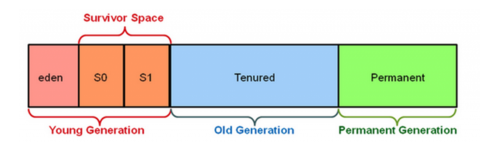

# JVM

### Java Virtual Machine이란?

Java는 "한 번 작성하면 어디서나 실행"이라는 개념으로 다양한 플랫폼에서 설계되어 있다. 예를 들어 특정 플랫폼 용으로 컴파일되고 기본적으로 실행되는 C++와 같은 프로그래밍 언어와 달리 Java 소스는 먼저 `.class` 파일인 바이트 코드로 컴파일 된다. 컴파일 된 클래스 파일은 `VM`(가상 머신)에서 해석이된다. 
즉, 자바 바이트코드로 컴파일된 어플리케이션을 실행하는 프로세스라고 할 수 있다. 
 

바이트 코드로 컴파일된 .class 파일을 실행시키게 되면 `JRE`가 동작한다. `JRE`는 해당 파일에 main() 메서드의 존재가 확인되면 `JRE`는 `JVM`을 실행시키게 된다. `JVM` 이제 해당 파일을 실행하게 된다.

### Class Loader

- java 클래스를 컴파일하면 플랫폼과 기계에 독립적인 바이트 코드로 변환이 됩니다.
- 컴파일된 클래스는 .class 파일로 저장이 됩니다.
- .class 파일을 실행시키면 Java ClassLoader가 올바르게 작성되었는지 바이트 코드를 검사하고 해당 클래스를 메모리에 로드합니다.

Class Loader 내부의 자세한 설명 : (https://javatutorial.net/java-class-loaders-explained)

### Runtime Data Area의 5가지 영역

- **Method Area (Static Area)**
  정적 변수를 포함하여(Constant Pool 포함) 모든 클래스 수준 데이터가 여기에 저장된다. JVM 당 하나의 메소드 영역만 있기 때문에 여러 스레드에서 공유하는 자원이다. 
  그러므로 스레드로 부터 안전하지 못하다.
- **Heap Area**
  모든 객체와 해당 인스턴스 변수 및 배열이 여기에 저장된다. JVM 당 하나의 힙영역이 있기 때문에 여러 스레드에서 공유하는 자원이다.  그러므로 스레드로부터 안전하지 못하다.
- **Stack Area**
  모든 스레드에 대해 별도의 런타임 스택이 생성된다. 모든 메서드 호출에 대해 스택 프레임이라고 하는 스택 메모리에 하나의 항목이 만들어진다. 모든 지역 변수는 스택 메모리에 생성된다. 스택 영역은 공유 자원이 아니므로 스레드로부터 안전하다.
- **PC Register**
  Program Count의 약자로 각 스레드는 별도의 PC 레지스터를 가진다. 해당 영역은 현재 실행하고 있는 부분의 주소(address)를 가지고 있다. 일반적으로 PC의 값은 현재 명령이 끝난 뒤 값을 증가시킨다. 그리고 해당하는 값의 명령을 실행하게 된다. 즉, 실행될 명령의 주소를 가지고 있다.
- **Native Method Stack**
  일반적으로 JVM은 네이티브 방식(c언어로 작성된) 을 지원한다. 일반적으로 메소드를 실행하는 경우 Stack Area에 쌓이다가 해당 메소드 내부에 네이티브 방식을 사용하는 메소드가 있다면 해당 메소드는 네이티브 메소드 스택에 쌓이게 된다. 모든 스레드에 대해서 별도의 네이티브 메서드 스택이 생성되게 된다.

### Execution Engine

Runtime Data Area에 할당 된 바이트코드가 Execution Engine에 의해서 실행된다. 즉, 바이트 코드를 기계어로 변환한다. 바이트 코드를 기계어로 변경할 때에 2종류의 방식을 사용 (`Interpreter`, `JIT Compiler`)

### Interpreter

Interpreter는 바이트 코드를 더 빨리 해석하지만 느리게 실행된다. Interpreter의 단점은 하나의 메서드가 여러번 호출되어도 매번 새로운 해석이 필요하다는 것이다.

### JIT Compiler

Just-In-Time의 약자로 쉽게 말하면 "동적 변환"이라고 보면 된다. 역사적으로 2가지의 프로그램 실행 방식이 있었다.

- 인터프리터(interpreter) 방식: 프로그램이 실행할 때마다 컴퓨터가 알아 들을 수 있는 언어로 변환하는 작업을 수행 => 간편하지만 성능이 매우 느리다
- 정적(static) 컴파일 방식: 실행하기전에 컴퓨터가 알아 들을 수 있는 언어로 변환하는 작업을 미리 실행한다 => 변환작업을 한번만 수행한다

JIT Compiler는 Interpreter의 단점을 무력화한다. Execution Engine은 처음 바이트 코드를 변환하는데 Interpreter를 사용하지만, 반복되는 코드를 찾으면 JIT Compiler가 네이티브 코드로 변경하여 메모리에 올려 두었다가 재사용을 하게된다.

### JNI (Java Native Interface)

JNI는 네이티브 메서드 라이브러리와 상호 작용하고 Execution Engine에 필요한 Native Library를 제공

### Native Method Library

Execution Engine에 필요한 Native Libraries의 모음

### GC(Garbage Collector)

GC는 참조되지 않은 객체를 수집하고 제거하여 메모리를 관리해준다. 객체가 참조되지 않고 쓸모 없는 것으로 판명 될 수 있는 방법 3가지

1. null
2. 다른 객체에 참조 할당
3. 익명 객체

##### JVM은 다음과 같이 영역을 나누어 Heap Area에 객체들을 관리한다.

)

가장 왼쪽에 Young영역에는 말 그대로 젊은 객체들이 존재 Old 영역에는 늙은 개체들이 자리잡게 된다. Permanent 영역에는 클래스나 메소드에 대한 정보가 쌓인다. 

1.  Eden 영역에 객체가 생성된다.
2.  Eden 영역이 꽉 차면 다른 Survivor 영역으로 객체가 복사되고 다시 Eden 영역을 채우게 된다.
3.  Survivor 영역이 꽉차면 다른 Survivor 영역으로 객체가 복사된다. 이 때, Eden영역에 있는 객체들 중 살아있는 객체들도 다른 Survivor 영역으로 간다. 즉, Survivor 영역에 둘중 하나는 반드시 비어 있어야 한다.

Young Generation에서 일어나는 것을 Young GC, Old Generation 에서 일어나는 GC를 Full GC 라고 한다.

- 장점
  사용되지 않은 메모리 공간은 GC에서 자동으로 처리하므로 수동적이지 않다.
  자동 메모리 누수 관리

- 단점
  객체 참조 생성 / 삭제를 추적하려면 더 많은 CPU 성능이 필요하며 대용량 메모리가 필요한 요청의 성능에 영향을 미칠 수 있다.
  일부 GC 구현을 사용하면 애플리케이션이 예기치 않게 중지 될 수 있다.
  어떤 경우에는 효율적이지 않을 수 있다.
