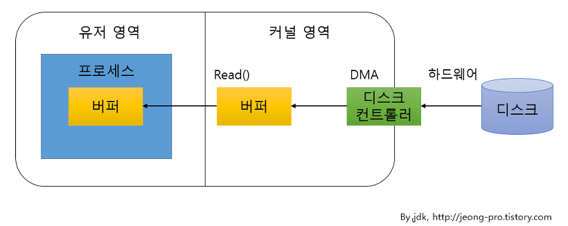
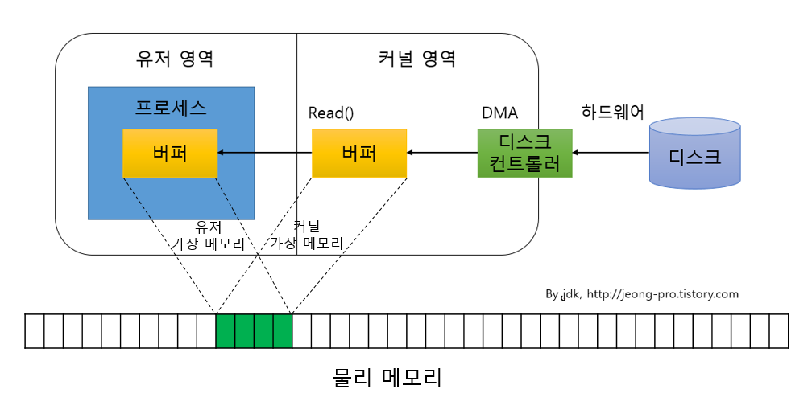

# NIO (New Input Output)

> NIO는 자바 4부터 새로운 입출력이라는 뜻에서 java.nio 패키지가 추가되었다. 또한 자바 7에서는 자바 IO와 NIO 사이의 일관성 없는 클래스 설계를 바로잡고 비동기 채널 등의 네트워크 지원을 대폭 강화한 NIO2 가 추가되었다. NIO2는 java.nio 패키지에 하위로 통합되어 있다. 그렇다면 IO와 NIO는 무엇이 다를까?

### IO는?

- **Stream 입출력** 
  IO는 스트림 기반이다. 스트림은 `단방향`을 지원한다. 스트림은 입력과 출력 스트림으로 구분되어 있기 때문에 입력과 출력을 위해서 따로 스트림을 생성해 주어만 한다.
   
   
- **Blocking** 
  IO 는 입출력시에 블로킹이 되며 IO 스레드가 블로킹시에 인터럽트도 할 수 없으며 다른 작업도 할 수 없다. 또한 커널 영역의 버퍼를 다시 유저 영역에 버퍼에 데이터를 복사하므로 상대적으로 직접 메모리에 접근하는 C, C++ 보다 느리다.
   

### NIO는?

- **Channel 입출력** 
  NIO는 채널 기반이다. 채널은 스트림과는 달리 `양방향`으로 입력과 출력은 지원하기 때문에 입력과 출력을 위해 별도로 2개가 아닌 하나의 채널만 생성해 주면 된다.
   
   
- **Buffer 사용** 
  NIO는 기본적으로 버퍼를 사용한다. 채널은 버퍼에 저장된 데이터를 출력하고 입력한다. 또한 읽은 데이터를 무조건 버퍼에 저장하기 때문에 버퍼 내에서 데이터의 위치를 이동해 가면서 필요한 부분만 읽고 쓸 수 있다.
   
   
- **가상 메모리** 
  가상 메모리는 프로그램이 사용할 수 있는 주소 공간을 늘리기 위해 운영체제에서 지원하는 기술이다. 실제 프로그램이 실행되는 데 지금 필요한 페이지단위의 가상 주소만 물리 메모리에 넣어 놓는 것이다. 가상 메모리의 장점은 2가지가 있다. 하나는 실제 메모리 보다 큰 가상 공간을 사용할 수 있다는 점이고, 또 하나는 여러개의 가상 주소가 하나의 물리적 메로리를 참조함으로써 메모리를 효율적으로 사용할 수 있게 해준다는 점이다. 
  위 그림과 같이 커널영역의 버퍼와 유저영역의 버퍼가 하나의 물리메모리를 참조 함으로써 IO에서 복사하던 방식을 하지 않음으로 성능상 이점이 있다.
   
   
- **Non-Blocking** 
  NIO는 블로킹과 넌블로킹의 특징을 모두 가지고 있다. IO블로킹과의 차이점은 NIO블로킹은 스레드를 인터럽트 함으로써 바져나올 수 가 있다는 것이다. NIO 넌블로킹은 준비가 완료된 채널만 선택해서 작업스레드가 처리하기 때문에 작업 스레드가 블로킹 되지 않는다. 이는 `Selector`가 제공하는 기능으로 셀렉터는 복수 개의 채널중에서 준비 완료된 채널을 선택하는 방법을 제공해준다. 즉, 쓰레드가 많이 생성될 수 록 떨어지던 성능 저하를 개선해주었다.
   

### IO와 NIO 둘 중에 어느 것을 써야할까?

NIO는 불특정 다수의 클라이언트 연결 또는 멀티 파일들을 넌블로킹이나 비동기로 처리할 수 있다. 때문에 과도한 쓰레드 생성을 피하고 효과적으로 쓰레드를 재사용한다는 점이 장점이다. 또한 운영체제의 버퍼를 사용하기 때문에 성능상으로도 장점이다.  
 
즉, NIO는 연결 클라이언트 수가 많고 하나의 입출력 처리 작업이 오래 걸리지 않는 경우에 사용하는 것이 좋다. 스레드에서 입출력 처리가 오래 걸린다면 대기하는 작업의 수가 늘어나기 때문에 제한된 쓰레드로 처리하는 것이 불리할 수 도 있다. 대용량 데이터를 처리할 경우에는 IO가 더 유리한데, NIO는 버퍼의 할당 크기도 문제가 되고, 모든 입출력 작업에 무조건 버퍼를 사용하므로 즉시 처리하는 IO보다 좀 더 복잡하다. 하여 연결 클라이언트 수가 적고 전송되는 데이터가 대용량이면서 순차적으로 처리될 필요성이 있으면 IO로 서버를 구현하는 것이 나을 것이다.
