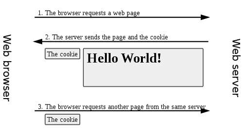
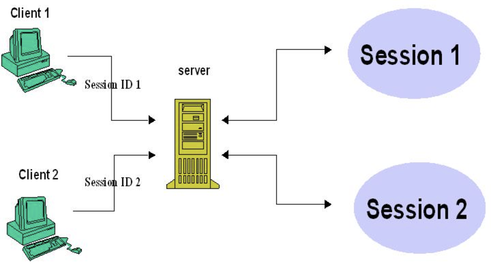

# 쿠키 (Cookie)와 세션(Session)

### 쿠키와 세션의 필요성

HTTP의 `stateless`와 `connectionless`한 특징의 한계성

- `connectionless` : 클라이언트의 요청을 한 후 응답을 받으면 연결을 끊어 버리는 특성
- `stateless` : 연결이 끊긴후 상태 정보를 유지하지 않는 특성  
  때문에 쿠키와 세션을 사용하지 않으면 클라이언트측의 요청에 대하여 서버는 알고있는 정보가 없으므로 매 번 같은 정보를 전달해야한다. 예를 들어 페이지를 옮기면 로그인 정보도 다시 입력해 주어야하고 장바구니도 옷을 추가하여도 다른 페이지에 가면 이와 같은 상태를 알지 못한다. 하지만 쿠키와 세션을 사용한다면 이러한 한계를 극복할 수 있다.

### 쿠키 ( Cookie )

> 쿠키는 웹 브라우저 로컬에 저장되는 데이터이다. 웹 브라우저는 웹 서버에 요청을 보낼 때 쿠키를 함께 전송하며, 웹 서버는 웹 브라우저가 전송한 쿠키를 이용하여 필요한 데이터를 읽을 수 있다. Response Header에 Set-Cookie 속성으로 웹 브라우저에 쿠키를 보낸다. 이후 웹 브라우저가 Request시에 자동으로 쿠키를 넣어 전송한다.

##### 쿠키의 동작 방식

1. 쿠키 생성 단계 : 클라이언트에서 서버로 요청을 보내면 서버에서 쿠키를 생성한다.
2. 쿠키 저장 단계 : 서버에서 응답 데이터 헤더에 쿠키를 포함시켜 보낸다. 클라이언트는 응답 데이터에 포함된 쿠키를 저장소에 보관한다. 여기서 쿠키는 여러가지 종류가 있는데 종류에 따라서 메모리나 파일로 저장한다.
3. 쿠키 전송 단계 : 클라이언트는 저장한 쿠키를 서버에 요청할 때마다 전송한다. 이후 서버에서 전송받은 쿠키를 이용하여 작업을 처리한다.

##### 쿠키의 구성요소

- Name : 각각의 쿠키를 구별하는 데 사용되는 이름
- Value : 쿠키에 저장된 값
- Expires : 쿠키의 유지 시간 (유지 시간 미지정시 브라우저 종료시 쿠키 삭제)
- Domain : 쿠키가 사용되는 도메인을 지정 (다른 도메인에서의 쿠키 사용을 막기위해)
- Path : 쿠키를 공유할 기준 경로를 지정
- Secure : 보안 연결 설정
- HTTPOnly : HTTP외에 다른 통신 사용 가능 설정

##### 쿠키의 종류

| 쿠키 이름          | 특징                                                                                          |
| ------------------ | --------------------------------------------------------------------------------------------- |
| Session Cookie     | 보통 만료시간(Expire) 설정하고 메모리에만 저장되며 브라우저 종료시 쿠키를 삭제                |
| Persistent Cookie  | 장기간 유지되는 쿠키(ex 1년), 파일로 저장되어 브라우저 종료와 관계없이 지속적으로 사용 가능   |
| Secure Cookie      | HTTPS에서만 사용, 쿠키 정보가 암호화 되어 전송된다                                            |
| Third-Party Cookie | 바운한 도메인과 다른 도메인 쿠키, 보통 광고 배너 등을 관리할 때 유입 경로를 추적하기위해 사용 |
| Http-Only Cookie   | HTTP 또는 HTTPS 요청시에만 사용가능 (api요청 x)                                               |

##### 쿠키의 단점

- 쿠키에 대한 정보를 매 번 헤더에 포함하여 보내기 때문에 트래픽 증가
- 쿠키 유출에 대한 보안적인 취약성

### 세션 ( Session )

> 쿠키의 보안적인 취약성을 위해 등장하였다. 세션은 서버에 정보를 보관하는 공간이다. 서버에서는 새로운 요청에 대하여 세션을 만들고 세션id로 쿠키를 만들어 웹 브라우저로 보내게 되며 쿠키를 이용하여 이 후 요청에 대하여 세션id로 정보를 찾는다.

##### 세션 동작 방식

1. 클라이언트에서 서버에 요청
2. 서버에서 요청 헤더에 Session id에 대한 쿠키가 없으면 Session을 새로 만들어 Session id를 쿠키로 만들어 응답헤더에 추가하여 보낸다.
3. 이후 클라이언트에서는 해당 쿠키를 이용하여 서버에 요청을 보낸다.

##### 세션의 장점

- 각 클라이언트에게 고유 ID 부여 (정확한 구분)
- 보안적인 측면에서 쿠키보다 좋음

##### 세션의 단점

- 서버의 부하 : 서버에 데이터를 저장하므로 양이 많아질수록 부하가 커진다.

##### 세션의 주의점

- 세션의 유효 시간을 지정하지 않으면 세션 객체가 계속해서 서버의 메모리 상에 쌓이게 되며 결국 메모리 부족 현상이 발생하게 된다. 그래서 유효 시간을 정해주거나 종료 메서드를 호출해 줘야한다.

- 보통 WAS는 많이 구성하게된다. 이를 로드밸런싱을 통하여 여러 서버로 분산 되는데 세션의 경우 서버에 저장되므로 동기화 과정이 필요하다. (ex 세션 정보를 하나의 저장장치에 공유 하는 것)
