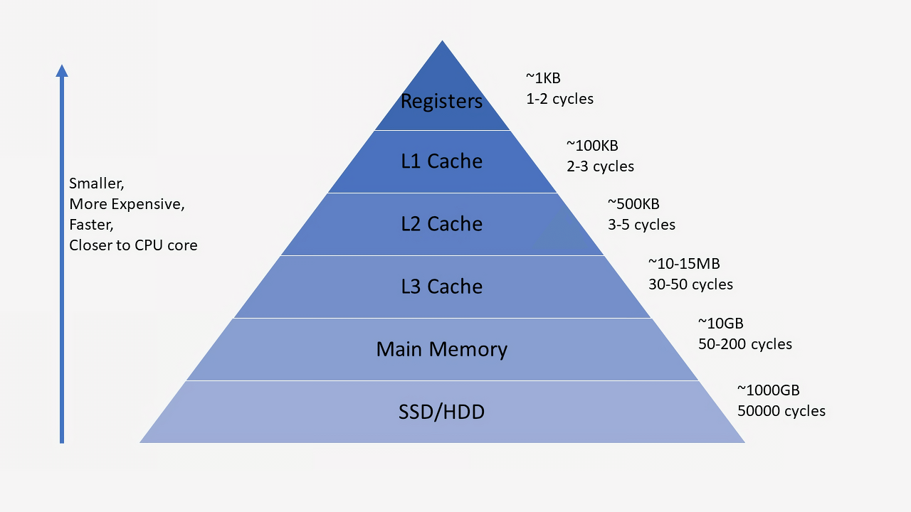

# 캐시

### 캐시(Cache)란?

---

#### [캐시]

`자주 사용하는 데이터를 미리 복사해 놓는 임시 장소`를 가리킨다. 캐시는 저장공간이 작고 비싸지만 빠른 응답 속도를 제공해준다.  
 

캐시에 반복되는 계산의 결과나 데이터를 복사해 놓는다면 계산과정이나 이미지 같은 데이터를 시간이 비교적 오래걸리는 DBMS에 요청하지 않고 캐시에서 가져와 보다 빠른 응답을 할 수 있게 해준다. 그래서 결과적으로 DBMS의 부하를 줄이고 캐시를 이용해 애플리케이션의 성능을 높일 수 있다. `Long Tail` 법칙에 의하면 사용자들은 전체 시스템에서 20%의 자원만을 자주 요청하여 쓰이게 된다고 한다. 데이터 베이스와는 대조적으로 영구적으로 저장해야할 데이터는 부적합하다. 이런 부분에 캐시를 이용한다면 성능을 향상 시킬 수 있다.  
 

#### [언제 사용하나?]

- 데이터의 접근 시간이 오래 걸리는 경우  
- 이미지와 같이 정적인 데이터의 접근  
- 업데이트가 자주 발생하지 않는 데이터  
   

#### [캐시 히트와 캐시 미스]

캐시를 찾으면 캐시 히트 찾지 못하면 캐시 미스라고 한다. 효율적으로 데이터를 관리하기 위해서 일정한 알고리즘을 통해 캐시에 저장되는 데이터를 관리해야만 한다. 
 

#### [Local Cache vs Global Cache]

##### Local Cache

- 서버마다 캐시를 따로 저장  
- 다른 서버와 캐시에 저장된 데이터를 공유하기 어렵다.  
- 서버 내 캐시를 이용하기 때문에 속도가 빠르다.  
- 로컬 서버의 리소스를 이용한다.  

##### Global Cache

- 캐시서버를 따로 두어 여러 서버에서 참조하여 이용한다.  
- 대신 네트워크를 이용하기 때문에 `Local Cache`보다는 느리다.  
- 별도의 캐시 서버를 이용하기 때문에 서버간 데이터 공유가 쉽다.  
