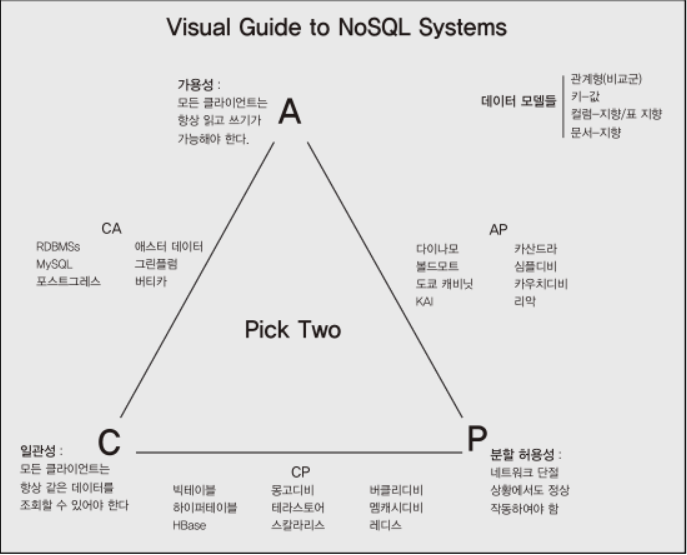

> NoSQL이란 빅데이터를 처리하기 위한 분산 데이터 저장소의 통칭
* 대용량 웹 서비스를 위하여 만들어진 데이터 저장소  
* 관계형 데이터 모델을 지양하며 대량의 분산된 데이터를 저장하고 조회하는데 특화된 저장소  
* 스키마 없이 사용 가능하거나 느슨한 스키마를 제공하는 저장소  
 
  
### NoSQL의 등장
2010년 이전에는 관계형 데이터베이스가 애플리케이션의 데이터 저장소를 위한 대중화된 솔루션이었다.
하지만 글로벌한 웹 서비스가 등장하기 시작하며 엄청나게 많은 데이터들을 축적하기 시작했다.
그런데 **일반적인 관계형 데이터베이스는 데이터의 양이 많아질수록 인덱스는 B트리 구조를 사용하기 때문에
 read/write의 성능 저하가 심해진다. 또한 중앙 집중식 데이터 관리 패턴이기 때문에 
단일 하드웨어의 성능에 따라 전체 시스템의 성능이 결정된다.**  
 

그래서 DB 개발사들은 분산 환경을 위해 트랜잭션을 느슨하게 처리하는 솔루션을 개발했지만 이는 곧
 애플리케이션의 복잡도와 개발 비용 증가로 이어졌다. 거기다 관계형 데이터베이스의 특성이 변하고
 동시에 분산환경에서도 그다지 최적화를 못하는 딜레마에 빠질 수도 있다. 
 

이 때 데이터를 실시간으로 분산 처리하는 개념으로 NoSQL이 등장하였다. NoSQL은 
분산환경에서 대량의 데이터를 빠르게 처리하기 위해 몇가지의 단점을 가지고 개발되었다.  
1. 관계형 데이터베이스의 `쿼리와 트랜잭션같은 편의기능이 제공되지 않는다.`  
2. 제공하는 데이터의 일관성 레벨도 NoSQL별로 다르다.  
3. 솔루션을 도입하기 위해 해당 NoSQL의 설계 사상과 내부구조를 파악해야만 한다.  
    
   
그럼에도 NoSQL은 쓰는 이유는 `하드웨어 추가에 따른 성능의 선형 증가`를 얻을 수 있다는 장점이 있다.  
 

NoSQL의 등장과도 더불어 전통적인 데이터베이스 중심의 애플리케이션 개발에서 서비스 중심의 개발
로 패러다임 전환이 일어났다. 그래서 데이터베이스를 중앙 데이터 저장소가 아니라 서비스 도구로서 
바라보게 되었다.  
 

### CAP (Consistency, Availability, Partition Tolerance) 정리
> 일관성, 가용성, 분할 허용성 모두를 동시에 지원하는 분산 컴퓨터 시스템은 없다!

NoSQL은 일관성, 가용성, 분할 허용성 가운데 두가지 속성만을 지원하며 나머지 한 속성은
 특정 조건에서만 만족한다가 CAP 정리의 핵심이다.  
 

#### 일관성
`다중 클라이언트에서 같은 시간에 조회하는 데이터는 항상 도일한 데이터임을 보증하는 것`  
클라이언트 A가 값을 변경했다면 클라이언트 B에서도 변경된 값을 알 수 있어야 한다. 
일관성은 관계형 데이터베이스가 지원하는 가장 기본적인 기능이다. 하지만 NoSQL은 분산처리를 위해서 
일관성을 희생하기도 한다.  
 
NoSQL의 분산 노드간 데이터 동기화를 위한 두가지 방법  

1. 데이터의 저장 결과를 클라이언트로 응답하기 전 모든 노드에 데이터를 동기화하는 방법  
`응답시간이 느려지지만 데이터의 정합성을 보장한다.`  
    
   
2. 메모리나 임시 파일에 기록하고 클라이언트에 먼저 응답 후 특정 이벤트 또는 프로세스를 이용하여
 노드로 데이터를 동기화하는 비동기식 방법  
   `응답시간이 빠르지만 쓰기노드에 장애가 났을 때 데이터 유실이 있을 수 있다.`  
    
   
대부분의 NoSQL은 읽기와 쓰기의 성능을 위해 데이터를 메모리에 임시로 저장한 뒤 
클라이언트에 응답하고 백그라운드 스레드로 해당 데이터를 디스크에 기록하는 2번 방법을 사용한다.  
데이터의 유실이 발생할 수도 있기 때문에 카산드라와 HBase에서는 커밋로그 및 WAL(Write Ahead Log)
파일에 먼저 정보를 기록하여 유실을 방지하며 Redis에서도 유사한 기능인 AOF(Append Only File)를 사용한다.  
 

#### 가용성
`모든 클라이언트의 읽기와 쓰기 요청에 대하여 항상 응답을 보장하는 것 (내고장성)`  
즉, 클러스터 내에서 노드가 고장나더라도 서비스가 장애가 나서는 안된다.  
 

몇몇 NoSQL은 가용성을 위해 데이터 복제를 사용한다. 동일한 데이터를 다중 노드에 중복 저장하여 
데이터의 유실을 방지하는 것이다. 
가용성을 위한 데이터 중복 저장 방법 두가지   
1. 동일한 데이터를 가진 저장소 복제 마스터 - 슬레이브 복제 방법  
2. 데이터 단위로 저장 피어-투-피어 복제 방법  
 
   
가용성에서 빠지지 않는 단어가 단일 고장점 SPOF(Single Point Of Failure)이다. 하나의 요소가
 망가졌을 때 시스템 전체를 멈추게 만드는 요소를 말한다. 단일 고장점을 가진 NoSQL은 자체적으로
 가용성을 지원 못하기 때문에 이를 위해 별도의 솔루션을 함께 사용하기도 한다.  
 

#### 네트워크 분할 허용성 (Partition tolerance)
`지역적으로 분할된 네트워크 환경에서 동작하는 시스템에서 네트워크 단절이나 네트워크 데이터의
 유실이 일어나더라도 시스템은 정상적으로 작동해야 하는 것`  
즉, 서울과 대전 같이 클러스터가 구분되어 있을 때 네트워크 장애가 발생해도 시스템이 정상적이라면
 분할 허용성을 지원한다고 할 수 있다.  
 

### 언제 NoSQL은 사용하는 것이 좋을까?
관계형 데이터베이스는 충분히 데이터 저장소로서 역할을 다하고 있다. 복잡한 업무 로직을
 처리하는 경우에도 더 나은 성능을 보인다. 하지만 다음과 같은 경우 NoSQL이 필요하다.  
1. 대량의 단순 정보를 빠르게 저장하고 조회할 때  
2. 관계형 데이터베이스가 처리하지 못하는 대량의 데이터를 입력할 때  
3. 스키마가 고정되지 않은 데이터를 저장하고 조회할 때  
 
   
위와 같은 경우라면 어떤 NoSQL을 사용할지도 중요한 사안이다.  
완벽한 일관성을 제공받기 위해서는 가용성을 포기하든가, 일관성 레벨을 All로 설정하여 성능을
희생하여야 한다. 보통 성능을 희생한다. 그렇다면 결과적으로 관계형 데이터베이스와 차이없는
 성능을 얻게 될 수도 있다.  
 

** NoSQL을 선택할 때 고려할 사항 **  
* 어느정도의 일관성이 필요한지?  
* 선택한 NoSQL의 데이터 모델로 필요한 기능을 구현할 수 있는지?
* 기능의 읽기와 쓰기의 비율  
* 단일 고장점을 가지고 있는지?  
* 트랜잭션 지원 여부와, 단일 연산에 대한 원자성 지원 여부 확인  
* 하드웨어 구성 : NoSQL의 시스템 아키텍처  
* 시스템을 확장할 경우 시스템의 중단이 필요한지 여부  
